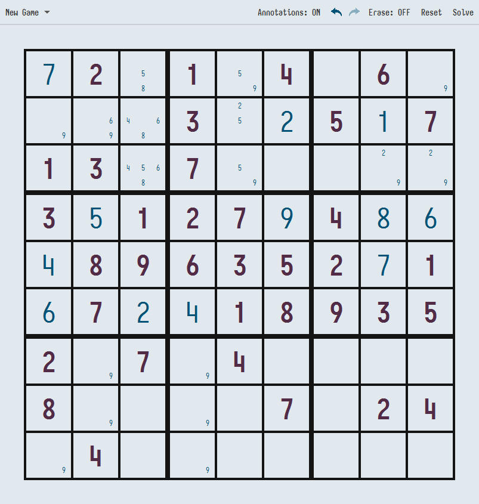

# Sudoku

A Sudoku app built with Java and the JavaFX library for a GUI.

[Color Palette](https://coolors.co/e2e9ee-005377-43aa8b-c33c54-ea638c-522b47)

## Features

- Annotations can be made on each cell, to visually indicate to the user what number that cell can be.
- Users use the undo and redo buttons to restore the board to a previous state.
- Erase a number or annotation from a cell.
- Reset the board to its original state.
- Solve the puzzle regardless of its current state.
- Load a new puzzle of three given options.

### Import a Puzzle

Users can import a puzzle using a simple CSV file, where 0s represent a blank cell.
See files in the [input directory](input/) for examples.
